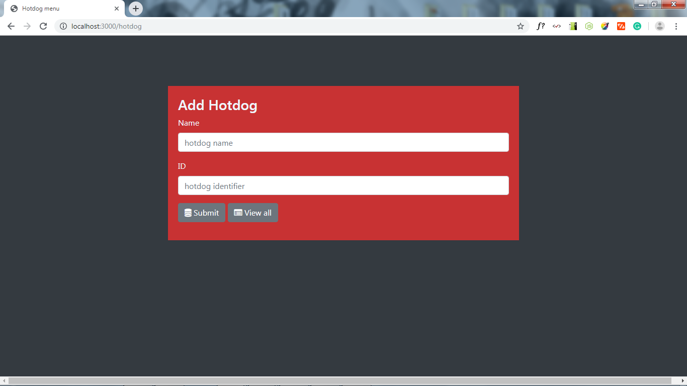
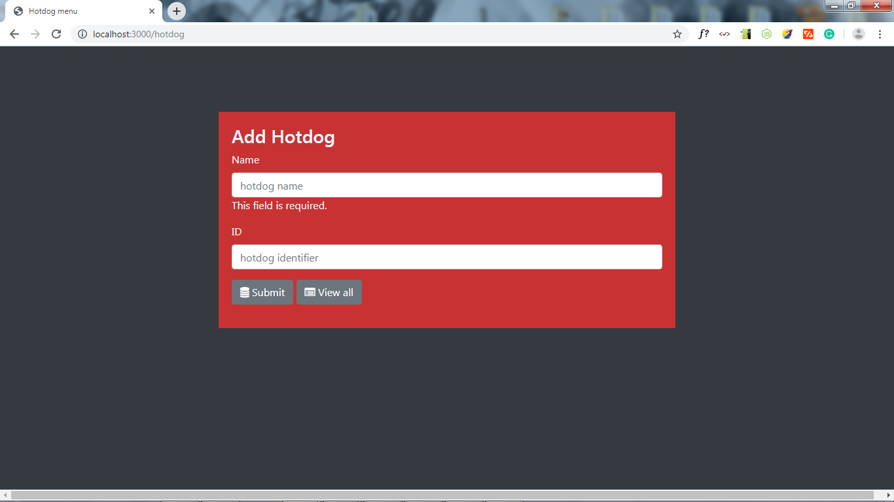
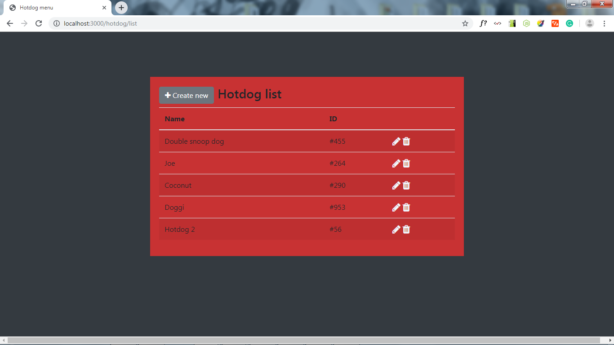
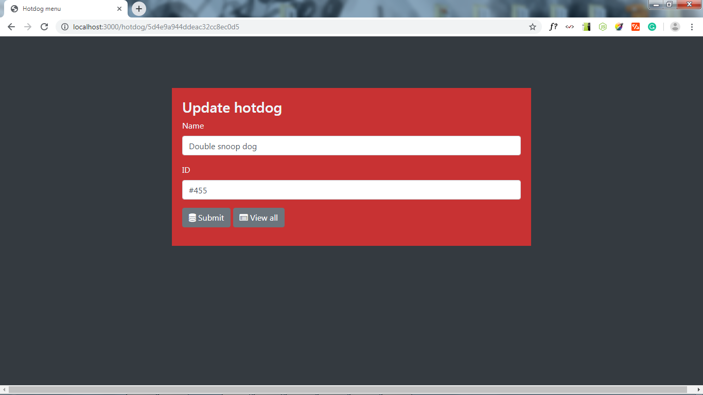
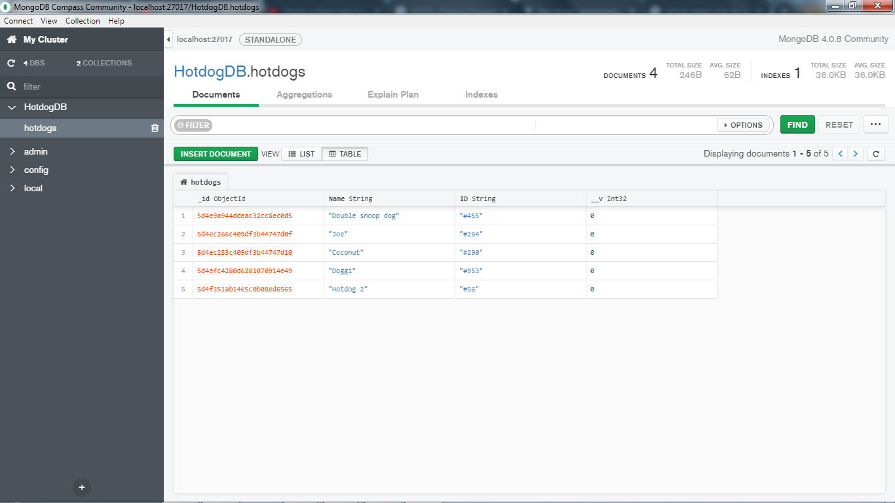
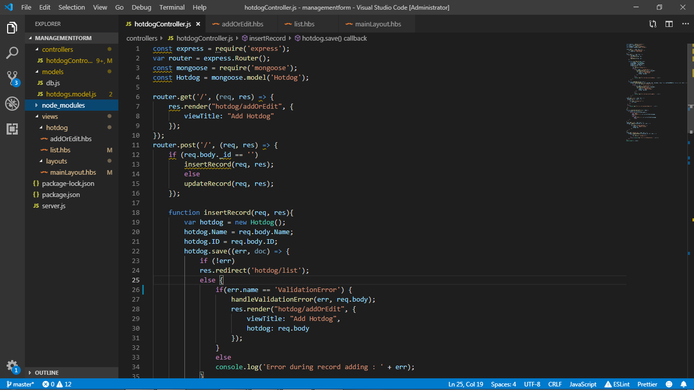

# managementform
The app which allow to store data and manage it. Created with mongodb-express-react-node.js (screenshots added)

screenshot: adding of the product

screenshot: required input

screenshot: all listed products with buttons to add new, edit existing product and delete

screenshot: editing processs

screenshot: db shown in compass

screenshot: project tree in left side
